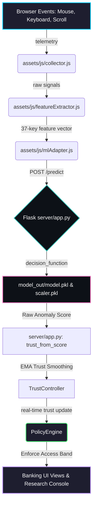

<!-- Centered Header Banner -->
<div align="center">
  
  
  # 🛡️ Sentinel

  ### **Continuous Behavioral-Authentication Banking Prototype**
  
  *Next-Generation Zero-Trust Security Powered by Real-Time Telemetry and Isolation Forest Anomaly Detection*

  <br>

  <!-- Shields.io Badges for tech stack -->
  [](https://www.python.org/)
  [](https://flask.palletsprojects.com/)
  [](https://scikit-learn.org/)
  [](https://developer.mozilla.org/en-US/docs/Web/JavaScript)
  <br>
  [](https://developer.mozilla.org/en-US/docs/Web/HTML)
  [](https://developer.mozilla.org/en-US/docs/Web/CSS)
  [](https://sqlite.org/)
  [](https://pandas.pydata.org/)
</div>

---

## 📖 Table of Contents
* [🌟 Project Overview](#-project-overview)
* [⚡ Key Features](#-key-features)
* [⚙️ System Architecture & Data Flow](#️-system-architecture--data-flow)
* [📊 Adaptive Security Policy Matrix](#-adaptive-security-policy-matrix)
* [📈 Offline Model Evaluation](#-offline-model-evaluation)
* [🚀 Getting Started (Live Demo)](#-getting-started-live-demo)
* [🧠 Machine Learning Pipeline Commands](#-machine-learning-pipeline-commands)
* [🔒 Security & Cryptographic Details](#-security--cryptographic-details)
* [📂 Project Layout](#-project-layout)

---

## 🌟 Project Overview

**BankGuard** is a fully functional continuous behavioral-authentication prototype. Unlike standard authentication methods (which check identity only once at login), BankGuard **continually verifies** that the logged-in user is indeed the owner throughout the session by analyzing behavioral biometrics:

1. **Typing Dynamics**: Keydown/keyup times, dwell intervals, and flight times.
2. **Mouse Movements**: Speed, acceleration, jerk, std dev, and straightness.
3. **Scroll Mechanics**: Patterns in page navigation.

These interaction patterns are captured in the browser, summarized into a **37-dimension feature vector** every few seconds, and transmitted to a Python Flask API. An offline-trained **Isolation Forest** model evaluates the vector to detect anomalies. The resulting anomaly score is calibrated into a **0–100% Trust Score** and smoothed using an **Exponential Moving Average (EMA)** to filter transient noise before updating the app's access policy in real-time.

---

## ⚡ Key Features

* **🔌 Real-Time Telemetry Collector**: Captures keystrokes, mouse moves, and scroll dynamics without interfering with the user experience.
* **🧠 Isolation Forest Anomaly Detection**: Model trained solely on genuine owner behavior. Impostor/negative profiles are never required during fitting—only for calibration.
* **〰️ EMA Trust Smoothing**: Employs Exponential Moving Average (`α = 0.4`) to absorb temporary noise, preventing false-positive lockouts while maintaining high sensitivity to user changes.
* **🛡️ Fail-Closed Security**: Decays trust scores gracefully to `0%` if telemetry is lost or the ML API is unreachable, securing the dashboard.
* **🔑 Secure Local Hashing**: Utilizes **Argon2id** (via `argon2-cffi`) to protect owner passwords and emergency lockout recovery keys stored in SQLite.

---

## ⚙️ System Architecture & Data Flow

Below is the runtime flow representing how behavioral interactions are captured, evaluated, and enforced:



---

## 📊 Adaptive Security Policy Matrix

Based on the smoothed trust score, the `PolicyEngine` dynamically limits banking views and operations:

| 🛡️ Policy Band | 📈 Trust Range | 🏷️ Label | 🔒 Action & Friction Level |
| :--- | :--- | :--- | :--- |
| **`FULL`** | **`80% - 100%`** | **Full Access** | No friction. User can transfer funds and add beneficiaries freely. |
| **`STEPUP`** | **`60% - 79%`** | **Step-Up Verification** | High-value transactions (exceeding **₹50,000**) require SMS/MFA verification. |
| **`RESTRICT`** | **`40% - 59%`** | **Restricted Access** | Suspicious behavior detected. Fund transfers are disabled; beneficiary management is locked. |
| **`LOCK`** | **`< 40%`** | **Session Locked** | Critical risk. Session is instantly locked. Safe lockout recovery screen displayed. |

---

## 📈 Offline Model Evaluation

The Isolation Forest classifier is validated offline against genuine and hard-negative (impostor) sessions. Review the generated curves in the repository (`reports/figures/`):

### 1. ROC (Receiver Operating Characteristic) Curve
Evaluates the true-positive rate vs. the false-positive rate across decision thresholds.
<div align="center">
  
</div>

### 2. Policy Band Distribution
Displays the percentage of genuine and hard-negative test sessions that fall into each of our four policy tiers.
<div align="center">
  
</div>

### 3. Trust Score Histogram
Shows the separation of scores between genuine (blue) and impostor (red) sessions.
<div align="center">
  
</div>

---

## 🚀 Getting Started (Live Demo)

Follow these steps to run the interactive banking prototype locally:

### 1. Prerequisites
Ensure you have Python 3.9+ installed.

### 2. Install Dependencies
Create a virtual environment and install the required libraries:
```powershell
# Create virtual environment
python -m venv .venv

# Activate virtual environment
# On Windows:
.\.venv\Scripts\Activate.ps1
# On Linux/macOS:
source .venv/bin/activate

# Install required Python packages
pip install -r requirements.txt
```

### 3. Start the Flask Backend
Serves predictions and manages Argon2id credentials.
```powershell
python -m server.app
```
*(The model will load from `model_out/` and bind to `http://127.0.0.1:5000/`)*

### 4. Run the Frontend Web Server
In a **second terminal** (with `.venv` active), launch a static server:
```powershell
python -m http.server 8000
```
Navigate to:
```text
http://127.0.0.1:8000/
```

### 🔐 Demo Credentials
* **Username**: `owner`
* **Password**: `password123`
* **Recovery Key**: `emergency-recovery-key-2026`
*(You can modify these credentials securely inside the **Profile & Security** dashboard tab)*

---

## 🧠 Machine Learning Pipeline Commands

If you wish to rebuild the feature tables, retrain the model, or re-run the visualizations, use the following commands from the root directory:

```powershell
# 1. Compile genuine raw JSON/Parquet sessions into a feature table
python -m ml_pipeline.build_dataset --genuine-dir data\true_sessions --out data\processed\genuine.parquet

# 2. Compile hard-negative raw sessions
python -m ml_pipeline.build_dataset --negative-dir data\hardnegtive_sessions --out data\processed\hardnegative.parquet

# 3. Train the Isolation Forest model and calibrate score anchors
python -m ml_pipeline.train_model --genuine data\processed\genuine.parquet --negative data\processed\hardnegative.parquet --out-dir model_out

# 4. Re-generate all evaluation plots
python -m ml_pipeline.plot_results --genuine data\processed\genuine.parquet --negative data\processed\hardnegative.parquet --model-dir model_out --out-dir reports\figures
```

---

## 🔒 Security & Cryptographic Details

<details>
<summary>🔑 Password & Recovery Key Protection</summary>

BankGuard incorporates modern cryptographic hashing standard **Argon2id** (configured with parameters: `time_cost=3`, `memory_cost=65536`, `parallelism=2`) to guard sensitive inputs. Plaintext values are verified in-memory and are never stored to SQLite or exposed in terminal output logs.
</details>

<details>
<summary>📈 Trust Smoothing (EMA Formula)</summary>

To manage False Rejection Rate (FRR) anomalies caused by transient disruptions (e.g. user pauses typing or adjusts their posture), the server applies Exponential Moving Average smoothing on the trust score:

$$T_{smoothed} = \alpha \cdot T_{raw} + (1 - \alpha) \cdot T_{smoothed\_prev}$$

With $\alpha = 0.4$, the interface ignores brief score dips but correctly locks the UI when a sustained change in behavior is detected.
</details>

<details>
<summary>⚠️ Connection Lost & Fail-Closed Strategy</summary>

If the browser telemetry client loses connection to the Python API or fails to transmit telemetry within the window configured in `assets/js/config.js`, the `mlAdapter.js` drops the Trust Score to `0%`. This immediately triggers the `LOCK` policy, protecting account dashboards from exposure.
</details>

---

## 📂 Project Layout

```text
WEB_Lab/
  ├── index.html                  # Main dashboard application shell
  ├── requirements.txt            # Python dependencies
  ├── README.md                   # Visual project documentation
  ├── bankguard.db                # SQLite user and credential database
  ├── assets/
  │   ├── banner.jpg              # High-tech system header banner
  │   ├── css/
  │   │   └── main.css            # Custom layout and typography styles
  │   └── js/
  │       ├── app.js              # Application core initialization
  │       ├── collector.js        # Mouse, keyboard, and scroll listener
  │       ├── featureExtractor.js # Extracts 37 features from raw streams
  │       ├── mlAdapter.js        # Relays features to the Flask API
  │       ├── policyEngine.js     # Evaluates trust tiers and updates UI state
  │       ├── trustController.js  # Manages stream subscriptions and EMA
  │       ├── views.js            # HTML templates for the dashboard modules
  │       └── bankDB.js           # Seeds mock user profile, cards, and data
  ├── server/
  │   ├── app.py                  # Model API & credential controller
  │   ├── credentials_store.py    # Argon2id DB logic for login credentials
  │   └── recovery_key_store.py   # Argon2id DB logic for emergency keys
  ├── ml_pipeline/
  │   ├── feature_extractor.py    # Standard feature calculation engine
  │   ├── build_dataset.py        # Compiles raw session parquets
  │   ├── train_model.py          # Fits Isolation Forest & handles scaling
  │   ├── plot_results.py         # Matplotlib evaluator curves script
  │   └── parity_check.py         # Compares browser and python feature output
  ├── model_out/
  │   ├── model.pkl               # Isolation Forest model artifact
  │   ├── scaler.pkl              # RobustScaler artifact
  │   ├── calibration.json        # Calibrated decision score anchors
  │   └── stats.json              # Diagnostic accuracy and AUC metrics
  └── reports/
      └── figures/
          ├── fig_C_roc_curve.png                  # Generated ROC curve
          ├── fig_D_band_distribution_both.png     # Band evaluation chart
          └── fig_E_trust_histogram.png            # Score histogram
```
